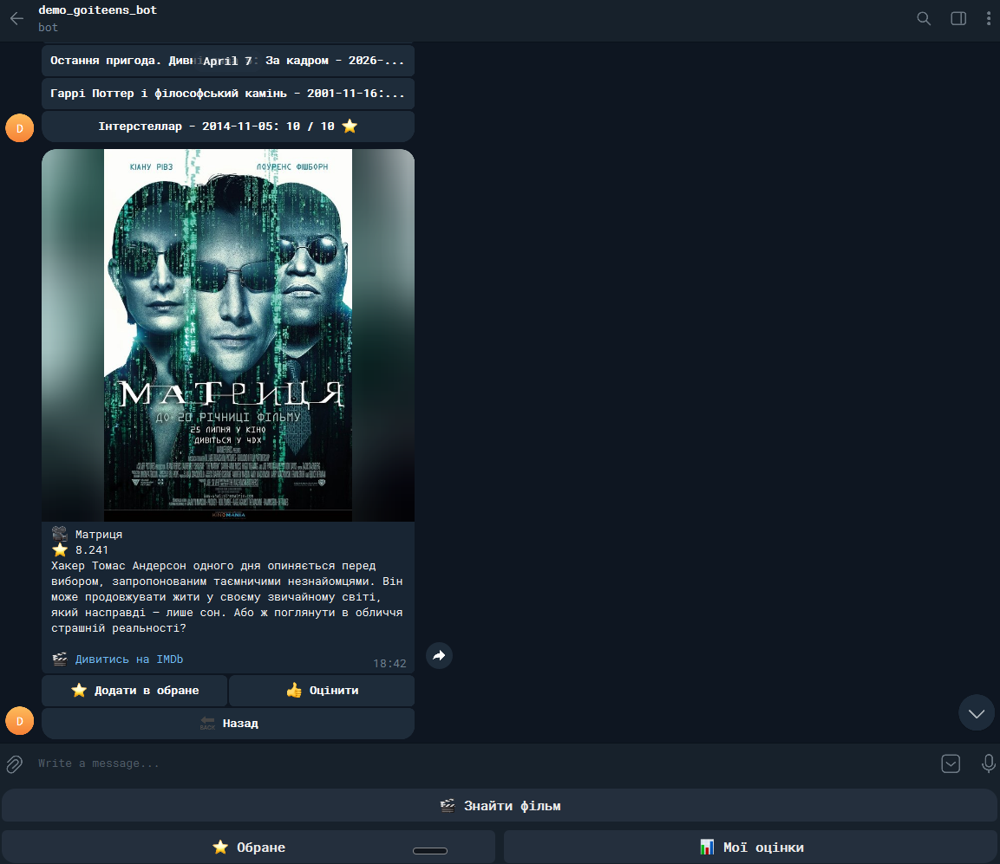

# 🎬 Films-Bot

A Telegram bot for searching for movies using the TMDB API.

The bot lets you search for movies, view ratings, and add them to your favorites list.

---

## ⚙️ Technical stack

    

---

## 📄 Requirements

> - [⚙️ Python 3.13](https://www.python.org/downloads/release/python-3130/)
> - [🎬 TMDB API key](https://developer.themoviedb.org/reference/intro/getting-started)
> - [👨‍🍼 Telegram Bot token](https://telegram.me/BotFather)

---

## 🚀 How to install

1. Clone the repository 
```bash
git clone https://github.com/vitalii0932/films-bot.git
cd films-bot
```
2. Create virtual environment 
```bash
python -m venv .venv
.venv/Scripts/activate
pip install -r requirements.txt
```
3. Create `.env` file with next variables:
```dotenv
TOKEN=Your telegram bot token
TMDB_API_KEY=Your tmdb api token
```
4. Run `python main.py`

---

## How to use



---

## 👥 Team:

- [John Doe](https://github.com/vitalii0932) - Project Lead / SEO
- [Jane Doe](https://github.com/vitalii0932) - Python developer
- [Jack Sparrow](https://github.com/vitalii0932) - UI/UX Designer
- [Sponge Bob](https://github.com/vitalii0932) - DevOps
- [Michel Doe](https://github.com/vitalii0932) - QA engineer

---

## 📌 Notes

Some useful info